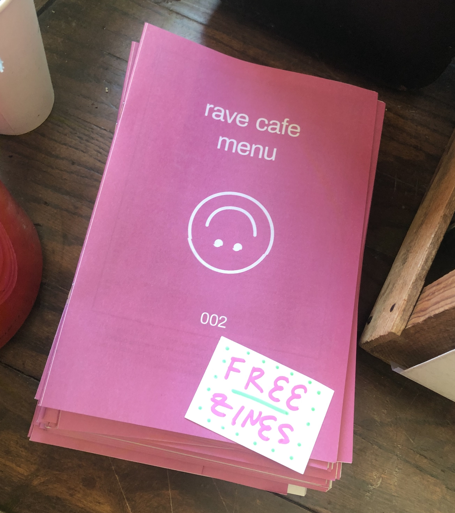
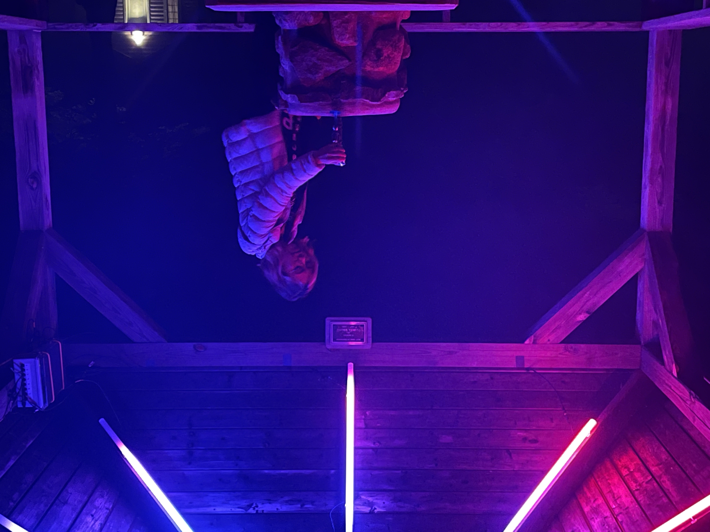
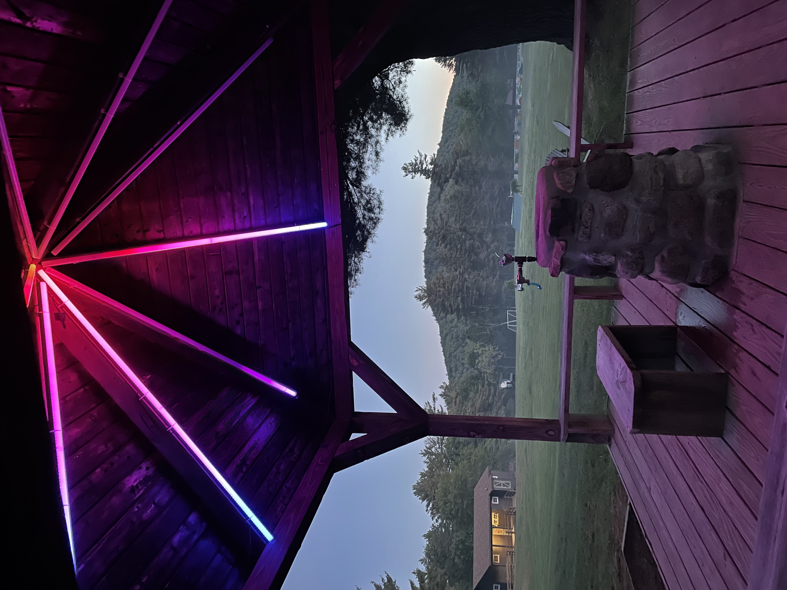

_by: Aileen Amaya and Adi Dahiya_

**Free water at the rave** is an ongoing project to advocate for accessible hydration in dance music communities across North America and the world.

Looking for resouces? Jump to [resources & references](#resources).

---

The following essay appeared in the [Rave Cafe](https://www.rave.cafe/) Zine 002, May 2023.

    

6am, Sunday morning of Movement festival: we’re leaving one club, en route to the next. It’s been a sweaty night. Ready for more dancing.

**_Push. Dance. Sweat. Hydrate. Bump. Eyes closed. Hands up. Repeat…_**

Our thoughts turn to 
powerful free-flowing water
   the mellifluous _bass_ vibrating the water        
molecules in our bodies 
      everything consumed
_synced_ in _frequency_.

Amidst this inexorable marathon weekend, we realized that some basic elements of self-care were neglected while we were locked in a groove of Detroit techno. Lack of sleep, expensive bottled water, thoughts consumed in a psychedelic vortex. Empty Nalgene bottles hung lightly from their carabiners. In this moment, our collective necessities became clear.

**_Water should be free and accessible for every raver_**.

We all know that it’s healthy to be well-hydrated, especially while partying, but sometimes there are physical, mental, financial, or political obstacles in our efforts to maintain this state. It's important to question & dismantle those obstacles, or at least find creative solutions to make free water accessible. If we don't, ravers will continue to suffer the effects of dehydration caused by hours of dancing, heat, and recreational drugs: headaches, fatigue, weakness, dizziness, irritability, cramps, vomiting, nausea, and other ailments.

**_A better world is possible when we prioritize communal care_**.

Across the many different dance music communities around the world, we find inconsistent access to free water. Promoters or venues often insist on profiting on hydration, or they fall back to laziness in situations where clean water access requires a bit of problem-solving. Their excuses are always weak; _everyone_ who throws a party has the capital and capacity to offer free water if they so choose.

### Thirsty for action?

Tips for taking accountability:

-   The first step is to account for water in the production budget for your party or festival.
-   If your venue does not have access to clean tap water, you will need to factor in the cost of bottled water to the overall production. This may increase the ticket prices slightly, but it’s worth it if everyone can hydrate freely.
-   Try to use refillable hydration stations and encourage guests to bring their own water bottles (we don’t need more plastic in landfills).
-   Ensure that your party has a place for people to rest, recover, and hydrate during extended sessions.

As a party-goer, look out for the symptoms of dehydration:

-   Thirst, headache, constipation, fatigue, weakness, dizziness, irritability, cramps, vomiting, and nausea can all be symptoms of dehydration.
-   Dark urine color is also a common syptom (according to [SportMedBC](https://sportmedbc.com/article/hydrating-for-activity/)), and is often easier to notice than other more subtle feelings in the body.

### Water activism

Our years of raving have eventually led us to activism for the cause of free water, inspiring us to share this message through conversation and art. At a [recent festival](https://www.shakermountain.com/) in upstate New York, we created an art piece called _The Water Shrine_. This site-specific piece transformed a seemingly ordinary gazebo on the festival grounds into a place that elevates and celebrates hydration.

    

The nighttime installation invited people who were taking a break from the party to sit down, refill their water bottles, and reflect or meditate under the soothing glow of slowly-shifting light beams. The lights were faintly visible from afar, but mostly as indirect light falling on the water fountain in the center of the gazebo. Curious observers walked closer to identify the light source in the ceiling of the gazebo and stopped to appreciate its shifting patterns. Once they stepped inside and reached the fountain, they become a part of the installation, bathed in light for others to notice — and perhaps to be inspired towards hydration themselves.

We’re not the first to argue for free water, but it’s important to keep beating this drum and spreading the message. If you’re an artist, consider joining our cause by creating work that centers hydration. Even in a world with rising temperatures and looming water shortages, venues & promoters must strive to uphold this principle, and party-goers should only support those events which prioritize communal care.

---

<a id="resources" href="#resources">

### Resources & references

</a>

-   [Drinking water should be free at all clubs and festivals, here's why &mdash; DJ Mag](https://djmag.com/content/drinking-water-should-be-free-all-clubs-and-festivals-here%E2%80%99s-why)
-   [Benefits of drinking water &mdash; Medical News Today](https://www.medicalnewstoday.com/articles/290814#benefits)
-   [Fluid Hydration in Sports](https://sportmedbc.com/article/fluid-first-hydration-in-sports/), [Hydrating for Activity](https://sportmedbc.com/article/hydrating-for-activity/) &mdash; [SportMedBC](https://sportmedbc.com)
-   [New York State Water Quality &mdash; ny.gov](https://water.ny.gov/doh2/applinks/waterqual/#/home)
-   [Amend the RAVE Act](https://amendtheraveact.org/)
-   [Advertising platform for water bottles to provide free water &mdash; FreeWater](https://www.freewater.io/)

### Get in touch

Feel free to reach out with questions, comments or concerns via [email](mailto:adi.dahiya14@gmail.com).
